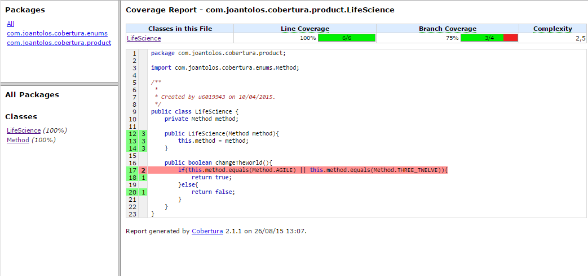

# Cobertura POC

## About Cobertura

Cobertura is a free Java tool that calculates the percentage of code accessed by tests. It can be used to identify which parts of your Java program are lacking test coverage. It is based on jcoverage.

For more information:

[Cobertura official web page](http://cobertura.github.io/cobertura/)

## Pre requisits
You will need the cobertura code from sourceforge:

[Cobertura download] (http://sourceforge.net/projects/cobertura/files/latest/download)

Once it's downloaded you will need an environment variable pointing to the extracted directory:

`export COBERTURA_HOME=${PATH}/cobertura-2.1.1`

You will need the ANT code from sourceforge:

[ANT download] (https://ant.apache.org/bindownload.cgi)

Once it's downloaded you will need an environment variable pointing to the extracted directory:

`export ANT_HOME=${PATH}/apache-ant-1.8.0`

## Use Maven and ANT to instrument and create the report

On the parent folder of the project type:

`mvn clean compile`

Then on the coverage folder type:

`${PARENT_FOLDER}/cobertura-plus-poc-coverage/script/ant instrument`

Then again on the parent folder:

`mvn test`

Then again to the coverage folder:

`${PARENT_FOLDER}/cobertura-plus-poc-coverage/script/ant report`

`${PARENT_FOLDER}/cobertura-plus-poc-coverage/script/ant cleanCoberturaFiles`

## Using SSH script to run all the steps with one command

For your comfort, you can use the script to make all the steps at the same time:

`${PARENT_FOLDER}/cobertura-plus-poc-coverage/script/`

`./createTestCoverageReport.sh`

This is an SSH script, so you will have to run it on Linux or use Cygwin tool or similar on Windows.

## Check the report

You will find the report on:

`${PARENT_FOLDER}/cobertura-plus-poc-coverage/report/index.html`

You will get a report like this:

